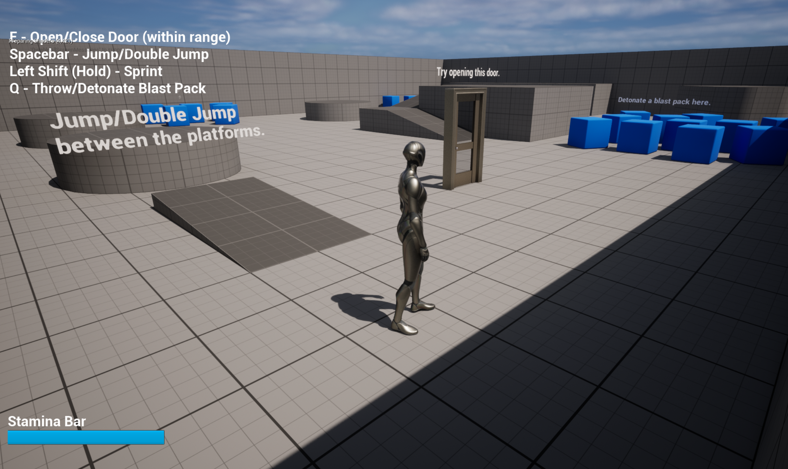

# Game Programmer Test Documentation
# Wan Ikmal Arif Bin Wan Othman
# Demo Video
https://www.youtube.com/watch?v=v5uCe5dPsic
# Test 1 
## 1. UPROPERTY() should be written above "TArray<AActor*> MyActors;". This is to avoid any pointers from getting Garbage Collected prematurely.
UPROPERTY()
TArray<AActor*> MyActors;
## 2. Spawning 100000 actors is not recommended as it may likely affect the game performance. 
## 3. Lack of nullptr checks which may cause crashes. 

# Test 2 - Game Features
The game features were implemented with mainly C++ as well as a few blueprints on Unreal Engine 5 (5.1.1).
This documentation presents the implementation methods used to create the game features including improvements that could be made.

## Game Feature 1 - Open/Close 2-Sided Door [E] (Time Taken: ≈ 45 mins)
This feature allows the player to open and close a door. The door initially could only open in the same direction regardless of the player's position. Therefore, it was changed so that it always opens away from the player, making it a 2-sided door. Moreover, line trace is used to ensure that the door can only be interacted with when the player faces it at a certain distance. 

Issues faced:
* Door was not getting hit by the line trace as intended when the start position was from the camera. 
* A box collision was an alternative in which it would allow the player to interact with the door when it overlaps the box. However, it was removed as the player could interact with the door even when it was not facing it, which did not look natural. 
* Issue was resolved after using line trace from the character's capsule component instead.

Improvements that can be made:
* The Interact Widget can be set to visible only when the player is facing the door and within range of interaction. 
* A feature where the player is able to control the amount of the door being opened can be created. 

## Game Feature 2 - Double Jump [Spacebar] (Time Taken: ≈ 20 mins)
Allows the player to double jump. The simpler way to implement this feature would be to change the 'JumpMaxCount' on Unreal Engine to 2. However, that does not allow a player to double jump if they were already falling as it counts falling as one jump. Hence, LaunchCharacter was utilised instead where the player can jump as long as it does not exceed the jump count of 2. Jump count resets when the player lands on a surface. 

Issues faced:
* Ensuring that the player can only jump twice max before landing.  

Improvements that can be made:
* LaunchCharacter parameters can be tuned to make the jump look more natural. 
* Allow the player to jump diagonally as well. 

## Game Feature 3 - Sprinting with Stamina [Left Shift] (Time Taken: ≈ 35 mins)
Sprinting was made by increasing the MaxWalkSpeed as it goes back to its initial value when the player stops sprinting. A stamina system was added to enhance the feature so that the player is unable to sprint forever. A short delay is also added where stamina can only be regained after the delay. The rate of the stamina being used and regained can be modified in the editor.

Issues faced:
* Stamina kept on being used even when the player was idle.
* Player could still run when stamina has depleted.
  
Improvements that can be made:
* Stamina starts depleting only when player runs at a certain speed, rather than relying on a boolean variable.
* Adding another effect to the player if player tries to sprint with no stamina (reduce health, lower walking speed).
* The stamina bar can be made to turn more red as stamina gets lower. 
* Player runs at a different speed with different stamina level. 

## Game Feature 4 - Blast Pack [Q] (Time Taken: ≈ 1 hour 15 mins)
The blast pack features a mechanic where a blast pack can be thrown and detonated to launch everything arond it with a radial force. The first 'Q' press spawns the blast pack whereas the second press detonates it. The pack can be used to launch the player themselves to reach a higher platform when detonated at the right angle. The detonation can also disrupt enemies' movements, or clear certain obstacles. 

Issues faced:
* Making sure that the blast pack spawns once before it can detonate.  
* Spawning the blast pack to the world. 

Improvements that can be made:
* Blast pack can be set to automatically detonate if player does not do so after a certain time. 
* The blast pack takes account of the player's movements as well when getting spawned. 
* Allow players to control the throwing distance of the blast pack. 

